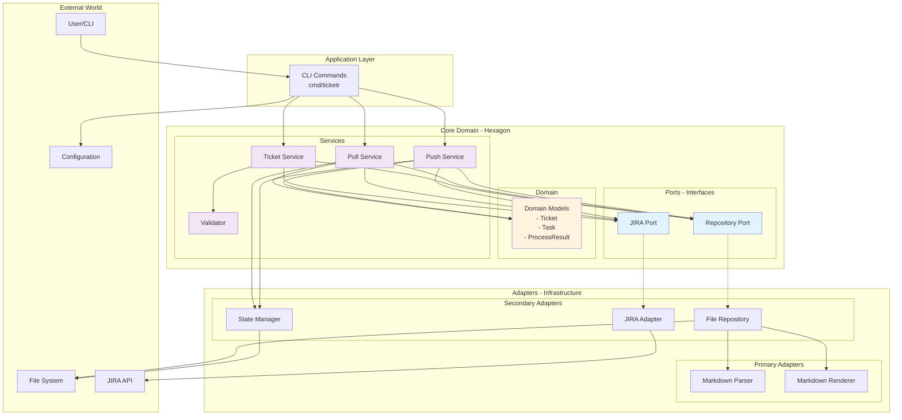

# Ticketr Architecture

## Overview

Ticketr follows the **Ports and Adapters** (Hexagonal) architecture pattern, which provides a clean separation between business logic and external dependencies. This architecture ensures the core domain remains independent of infrastructure concerns, making the system maintainable, testable, and adaptable to change.

## Architecture Diagram



## Component Responsibilities

### Core Domain (`internal/core/`)

The heart of the application, containing pure business logic with no external dependencies.

#### Domain Models (`internal/core/domain/`)
- **Purpose**: Define the core business entities
- **Components**:
  - `Ticket`: Represents a JIRA ticket with title, description, tasks, and metadata
  - `Task`: Represents a sub-task within a ticket
  - `ProcessResult`: Contains statistics about processing operations
- **Key Principles**: 
  - Immutable value objects where possible
  - No infrastructure dependencies
  - Rich domain behavior

#### Ports (`internal/core/ports/`)
- **Purpose**: Define interfaces for external dependencies
- **Components**:
  - `Repository`: Interface for ticket storage and retrieval
  - `JiraPort`: Interface for JIRA API operations
- **Key Principles**:
  - Dependency inversion - core depends on abstractions
  - Technology-agnostic interfaces
  - Clear contracts for adapters

#### Services (`internal/core/services/`)
- **Purpose**: Orchestrate business workflows
- **Components**:
  - `TicketService`: Manages ticket lifecycle and synchronization
  - `PullService`: Handles pulling tickets from JIRA with conflict detection
  - `PushService`: Manages pushing tickets to JIRA with state tracking
- **Key Principles**:
  - Encapsulate complex business logic
  - Coordinate between multiple ports
  - Transaction-like operations

#### Validation (`internal/core/validation/`)
- **Purpose**: Enforce business rules and data integrity
- **Components**:
  - `Validator`: Validates ticket hierarchy and required fields
- **Key Principles**:
  - Pre-flight validation before JIRA operations
  - Clear error messages for users
  - Hierarchical rule enforcement

### Adapters (`internal/adapters/`)

Implementations of the ports that connect the core to the external world.

#### File System Adapter (`internal/adapters/filesystem/`)
- **Purpose**: Handle file I/O operations
- **Components**:
  - `FileRepository`: Implements Repository port for file operations
- **Responsibilities**:
  - Read Markdown files
  - Write updated files with JIRA IDs
  - Coordinate with Parser and Renderer

#### JIRA Adapter (`internal/adapters/jira/`)
- **Purpose**: Integrate with JIRA REST API
- **Components**:
  - `JiraAdapter`: Implements JiraPort for JIRA operations
  - Dynamic field mapping support
- **Responsibilities**:
  - Create and update tickets in JIRA
  - Search and retrieve tickets
  - Handle authentication and API errors
  - Map custom fields dynamically

### Infrastructure Components

#### Parser (`internal/parser/`)
- **Purpose**: Parse Markdown files into domain models
- **Features**:
  - Hierarchical ticket structure parsing
  - Custom field extraction
  - Line number tracking for error reporting
- **Format Support**:
  - `# TICKET:` headers
  - Nested tasks with indentation
  - Description, Fields, and Acceptance Criteria sections

#### Renderer (`internal/renderer/`)
- **Purpose**: Convert domain models back to Markdown
- **Features**:
  - Preserve formatting and structure
  - Insert JIRA IDs into existing content
  - Support custom field rendering
- **Key Principles**:
  - Idempotent rendering
  - Preserve user formatting preferences

#### State Manager (`internal/state/`)
- **Purpose**: Track changes for intelligent synchronization
- **Features**:
  - SHA256 hashing of ticket content
  - Change detection between syncs
  - Conflict identification
- **Storage**: `.ticketr.state` file with JSON format

### Application Layer (`cmd/ticketr/`)

The command-line interface that users interact with.

#### Main Command (`main.go`)
- **Purpose**: CLI entry point and command routing
- **Commands**:
  - `push`: Sync from Markdown to JIRA
  - `pull`: Sync from JIRA to Markdown
  - `schema`: Discover JIRA fields
  - `stats`: Analyze ticket metrics
  - `listen`: Webhook server
- **Features**:
  - Configuration via environment variables
  - Verbose logging mode
  - Legacy command support

## Data Flow

### Push Flow (Markdown → JIRA)
1. User executes `ticketr push file.md`
2. CLI validates environment configuration
3. FileRepository reads the Markdown file
4. Parser converts Markdown to domain models
5. Validator performs pre-flight validation
6. TicketService orchestrates the push:
   - Creates new tickets in JIRA
   - Updates existing tickets
   - Processes tasks hierarchically
7. FileRepository writes back updated file with JIRA IDs
8. StateManager updates the state file

### Pull Flow (JIRA → Markdown)
1. User executes `ticketr pull --project PROJ`
2. CLI constructs JQL query from parameters
3. JiraAdapter searches JIRA for matching tickets
4. PullService orchestrates the pull:
   - Checks for existing local file
   - Detects conflicts using StateManager
   - Applies conflict resolution strategy:
     - `local-wins`: Preserves local changes
     - `remote-wins`: Overwrites with remote changes
     - No strategy: Reports conflict and exits
5. Renderer converts tickets to Markdown
6. FileRepository writes the Markdown file
7. StateManager updates tracking state

## Design Principles

### 1. **Separation of Concerns**
Each component has a single, well-defined responsibility. Business logic is isolated from infrastructure concerns.

### 2. **Dependency Inversion**
The core domain depends on abstractions (ports), not concrete implementations. This allows for easy testing and swapping of adapters.

### 3. **Testability**
The architecture supports comprehensive testing:
- Unit tests for domain logic
- Integration tests for adapters
- End-to-end tests for workflows

### 4. **Extensibility**
New features can be added without modifying the core:
- New adapters for different ticket systems
- Additional renderers for different formats
- Custom validators for organization-specific rules

### 5. **Error Handling**
- Graceful degradation with partial uploads
- Clear error messages with context
- Pre-flight validation to prevent partial failures

## Configuration

### Environment Variables
- `JIRA_URL`: JIRA instance URL
- `JIRA_EMAIL`: User email for authentication
- `JIRA_API_KEY`: API token for authentication
- `JIRA_PROJECT_KEY`: Default project key
- `JIRA_STORY_TYPE`: Issue type for stories (default: "Task")
- `JIRA_SUBTASK_TYPE`: Issue type for subtasks (default: "Sub-task")

### Configuration File (`.ticketr.yaml`)
```yaml
field_mappings:
  "Story Points": "customfield_10010"
  "Sprint": "customfield_10020"
  "Epic Link": "customfield_10014"
  
sync:
  pull:
    fields:
      - "Story Points"
      - "Sprint"
  ignored_fields:
    - "updated"
    - "created"
```

## Security Considerations

### Authentication
- API keys stored in environment variables
- No credentials in code or configuration files
- Support for CI/CD secret management

### Data Protection
- No sensitive data in state files
- Gitignore for environment files
- Secure HTTPS connections to JIRA

## Performance Characteristics

### Optimizations
- Batch operations where possible
- Lazy loading of ticket details
- Efficient state comparison using hashes
- Minimal API calls through intelligent diffing

### Scalability
- Handles files with hundreds of tickets
- Concurrent processing where safe
- Streaming parser for large files (future)

## Future Enhancements

### Planned Features
1. **Real-time Sync**: Webhook listener for instant updates
2. **Multiple Backends**: Support for GitHub Issues, Azure DevOps
3. **Template Engine**: Custom ticket templates
4. **Bulk Operations**: Mass updates and migrations
5. **Analytics Dashboard**: Web UI for metrics visualization

### Architecture Evolution
The Ports and Adapters pattern ensures these enhancements can be added without disrupting the core domain logic. New adapters can be plugged in, and new services can be added to orchestrate new workflows.
