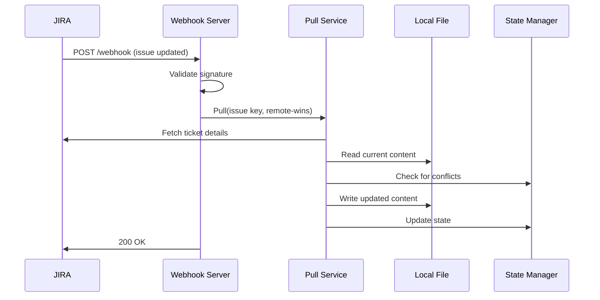

# Webhook Configuration Guide

This guide explains how to set up and use Ticketr's webhook server for real-time synchronization with JIRA.

## Overview

The webhook server enables real-time, automatic updates to your local Markdown files whenever tickets change in JIRA. This eliminates the need for manual pulling and ensures your local files always reflect the current state in JIRA.

## Prerequisites

- Ticketr installed and configured with JIRA credentials
- A publicly accessible server (for production) or ngrok/similar tool (for development)
- Administrative access to configure webhooks in JIRA

## Starting the Webhook Server

### Basic Usage

```bash
# Start with default settings (port 8080, tickets.md)
ticketr listen

# Specify custom port and file
ticketr listen --port 3000 --path project-tickets.md

# Enable webhook signature validation (recommended for production)
ticketr listen --secret your-webhook-secret
```

### Command-Line Options

- `--port`: HTTP port to listen on (default: 8080)
- `--path`: Path to the Markdown file to update (default: tickets.md)
- `--secret`: Webhook secret for signature validation (optional but recommended)

### Example Output

```
Starting webhook server...
  Port: 8080
  File: tickets.md
  Project: PROJ
  Security: Webhook signature validation enabled

Configure your JIRA webhook to send events to:
  URL: http://your-server:8080/webhook

Press Ctrl+C to stop the server
```

## Configuring JIRA Webhooks

### Step 1: Access JIRA Webhook Settings

1. Log into your JIRA instance as an administrator
2. Navigate to **Settings** → **System** → **Webhooks**
3. Click **Create a Webhook**

### Step 2: Configure the Webhook

Fill in the webhook configuration:

1. **Name**: `Ticketr Sync` (or any descriptive name)

2. **URL**: 
   - Production: `https://your-server.com:8080/webhook`
   - Development (with ngrok): `https://abc123.ngrok.io/webhook`

3. **Events**: Select the following JQL events:
   - ✅ Issue created
   - ✅ Issue updated
   - ✅ Issue deleted

4. **JQL Filter** (optional): 
   ```
   project = "PROJ" AND issuetype in (Story, Task, Bug)
   ```
   This limits webhooks to specific projects and issue types.

5. **Exclude body**: Leave unchecked (we need the issue data)

### Step 3: Security Configuration

#### Option A: Webhook Secret (Recommended)

1. In JIRA webhook configuration, set a **Secret** (e.g., `my-secure-webhook-secret-123`)
2. Start Ticketr with the same secret:
   ```bash
   ticketr listen --secret "my-secure-webhook-secret-123"
   ```

#### Option B: IP Whitelisting

Configure your firewall to only accept webhook requests from Atlassian's IP ranges:
- [Atlassian IP Ranges](https://support.atlassian.com/organization-administration/docs/ip-addresses-and-domains-for-atlassian-cloud-products/)

### Step 4: Test the Webhook

1. In JIRA webhook settings, click **Test** next to your webhook
2. Check the Ticketr server logs for incoming requests
3. Verify the test response shows status 200

## Production Deployment

### Using systemd (Linux)

Create a systemd service file at `/etc/systemd/system/ticketr-webhook.service`:

```ini
[Unit]
Description=Ticketr Webhook Server
After=network.target

[Service]
Type=simple
User=ticketr
WorkingDirectory=/home/ticketr
Environment="JIRA_URL=https://company.atlassian.net"
Environment="JIRA_EMAIL=bot@company.com"
Environment="JIRA_API_KEY=your-api-key"
Environment="JIRA_PROJECT_KEY=PROJ"
ExecStart=/usr/local/bin/ticketr listen --port 8080 --path /home/ticketr/tickets.md --secret "webhook-secret"
Restart=always
RestartSec=10

[Install]
WantedBy=multi-user.target
```

Enable and start the service:
```bash
sudo systemctl enable ticketr-webhook
sudo systemctl start ticketr-webhook
sudo systemctl status ticketr-webhook
```

### Using Docker

```dockerfile
FROM alpine:latest
RUN apk add --no-cache ca-certificates
COPY ticketr /usr/local/bin/
WORKDIR /data
EXPOSE 8080
CMD ["ticketr", "listen", "--port", "8080", "--path", "/data/tickets.md"]
```

Run with Docker:
```bash
docker run -d \
  --name ticketr-webhook \
  -p 8080:8080 \
  -v $(pwd):/data \
  -e JIRA_URL="https://company.atlassian.net" \
  -e JIRA_EMAIL="bot@company.com" \
  -e JIRA_API_KEY="your-api-key" \
  -e JIRA_PROJECT_KEY="PROJ" \
  ticketr:latest \
  ticketr listen --secret "webhook-secret"
```

### Using Docker Compose

```yaml
version: '3.8'

services:
  ticketr-webhook:
    image: ticketr:latest
    ports:
      - "8080:8080"
    volumes:
      - ./tickets.md:/data/tickets.md
      - ./.ticketr.state:/data/.ticketr.state
    environment:
      - JIRA_URL=${JIRA_URL}
      - JIRA_EMAIL=${JIRA_EMAIL}
      - JIRA_API_KEY=${JIRA_API_KEY}
      - JIRA_PROJECT_KEY=${JIRA_PROJECT_KEY}
    command: ticketr listen --port 8080 --path /data/tickets.md --secret ${WEBHOOK_SECRET}
    restart: unless-stopped
```

## HTTPS with Reverse Proxy

For production, always use HTTPS. Here's an nginx configuration example:

```nginx
server {
    listen 443 ssl http2;
    server_name ticketr.company.com;

    ssl_certificate /etc/ssl/certs/ticketr.crt;
    ssl_certificate_key /etc/ssl/private/ticketr.key;

    location /webhook {
        proxy_pass http://localhost:8080/webhook;
        proxy_set_header Host $host;
        proxy_set_header X-Real-IP $remote_addr;
        proxy_set_header X-Forwarded-For $proxy_add_x_forwarded_for;
        proxy_set_header X-Forwarded-Proto $scheme;
        
        # Increase timeout for webhook processing
        proxy_read_timeout 30s;
        proxy_connect_timeout 30s;
    }

    location /health {
        proxy_pass http://localhost:8080/health;
    }
}
```

## Development with ngrok

For local development, use ngrok to expose your local webhook server:

1. Install ngrok: https://ngrok.com/download

2. Start the Ticketr webhook server:
   ```bash
   ticketr listen --port 8080
   ```

3. In another terminal, start ngrok:
   ```bash
   ngrok http 8080
   ```

4. Use the ngrok HTTPS URL in your JIRA webhook configuration:
   ```
   https://abc123.ngrok.io/webhook
   ```

## Monitoring and Troubleshooting

### Health Check Endpoint

The webhook server provides a health check endpoint at `/health`:

```bash
curl http://localhost:8080/health
# Response: OK
```

Use this for monitoring tools like Prometheus, Datadog, or uptime monitors.

### Viewing Logs

#### systemd
```bash
sudo journalctl -u ticketr-webhook -f
```

#### Docker
```bash
docker logs -f ticketr-webhook
```

### Common Issues

#### Webhook Not Triggering

1. Check JIRA webhook history in Settings → System → Webhooks → View details
2. Verify the URL is correct and publicly accessible
3. Check firewall rules allow incoming connections
4. Verify JIRA project key matches your configuration

#### Signature Validation Failures

1. Ensure the secret in JIRA matches the `--secret` parameter exactly
2. Check for trailing spaces or special characters in the secret
3. Verify the webhook is sending the signature header

#### File Not Updating

1. Check file permissions allow the Ticketr process to write
2. Verify the file path is correct (absolute paths recommended)
3. Check the state file (`.ticketr.state`) is writable
4. Review server logs for error messages

#### Performance Issues

1. Ensure the server has sufficient resources
2. Consider implementing rate limiting if receiving many webhooks
3. Monitor disk I/O if updating large files frequently

## Security Best Practices

1. **Always use HTTPS in production** to prevent webhook payload tampering
2. **Enable webhook signature validation** with a strong secret
3. **Restrict webhook endpoint access** using firewall rules or reverse proxy
4. **Use a dedicated service account** for the JIRA API key
5. **Rotate secrets regularly** and store them securely
6. **Monitor webhook activity** for suspicious patterns
7. **Implement rate limiting** to prevent abuse

## Webhook Event Flow



## Advanced Configuration

### Multiple Projects

To handle multiple projects, run separate webhook servers on different ports:

```bash
# Terminal 1: Project A
JIRA_PROJECT_KEY=PROJA ticketr listen --port 8080 --path project-a.md

# Terminal 2: Project B  
JIRA_PROJECT_KEY=PROJB ticketr listen --port 8081 --path project-b.md
```

### Custom Processing

For advanced use cases, you can chain webhook processing with other tools:

```bash
#!/bin/bash
# webhook-processor.sh

# Start Ticketr webhook server in background
ticketr listen --port 8080 --path tickets.md &
TICKETR_PID=$!

# Monitor file changes and trigger additional actions
inotifywait -m tickets.md -e modify |
while read path action file; do
    echo "File updated, running custom processing..."
    # Your custom logic here
    git add tickets.md
    git commit -m "Auto-update from JIRA webhook"
    git push
done

# Cleanup on exit
trap "kill $TICKETR_PID" EXIT
wait $TICKETR_PID
```

## Limitations

- Webhook server processes one event at a time (no concurrent processing)
- Large files may take longer to update, potentially causing webhook timeouts
- Deleted issues are logged but not automatically removed from the file
- Binary attachments are not synchronized

## Support

For issues or questions about webhook configuration:

1. Check the [GitHub Issues](https://github.com/karolswdev/ticketr/issues)
2. Review JIRA's [Webhook Documentation](https://developer.atlassian.com/cloud/jira/platform/webhooks/)
3. Enable verbose logging with `-v` flag for detailed troubleshooting