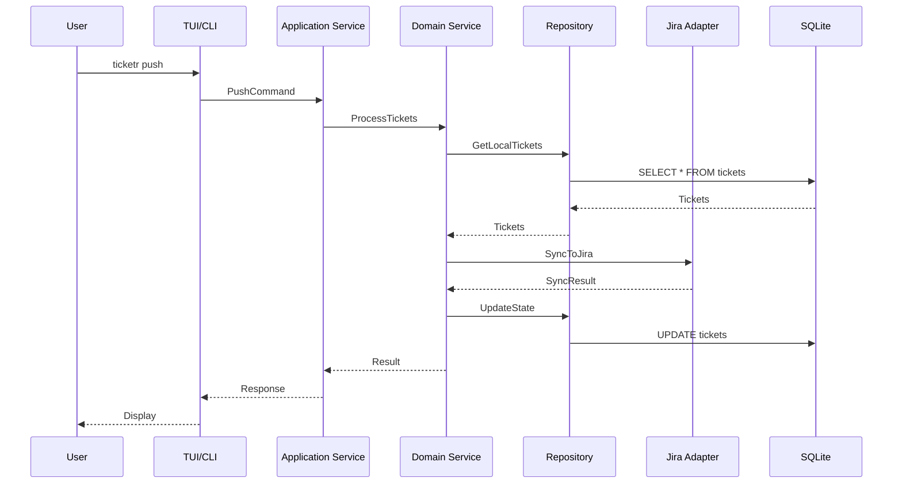

# Ticketr v3.0 Technical Specification

**Version:** 1.0
**Status:** Draft
**Last Updated:** January 2025

---

## Table of Contents

1. [System Architecture](#system-architecture)
2. [Data Models](#data-models)
3. [API Specifications](#api-specifications)
4. [Database Design](#database-design)
5. [Security Model](#security-model)
6. [Performance Requirements](#performance-requirements)
7. [Testing Specifications](#testing-specifications)

---

## System Architecture

### Hexagonal Architecture Layers

```
┌──────────────────────────────────────────────────────┐
│                  Presentation Layer                   │
│         (CLI, TUI, Future: API, Web, Plugins)        │
├──────────────────────────────────────────────────────┤
│                  Application Layer                    │
│            (Use Cases, Command Handlers)             │
├──────────────────────────────────────────────────────┤
│                    Domain Layer                       │
│          (Entities, Value Objects, Events)           │
├──────────────────────────────────────────────────────┤
│                 Infrastructure Layer                  │
│        (Database, Jira API, File System, OS)         │
└──────────────────────────────────────────────────────┘
```

### Component Interaction Flow



---

## Data Models

### Core Domain Entities

```go
// internal/core/domain/entities.go

// Aggregate Root
type Workspace struct {
    ID          WorkspaceID
    Name        string
    Config      WorkspaceConfig
    Credentials CredentialRef
    Statistics  WorkspaceStats
    CreatedAt   time.Time
    UpdatedAt   time.Time
}

// Entity
type Ticket struct {
    ID                TicketID
    WorkspaceID       WorkspaceID
    JiraID            *string
    Type              IssueType
    Title             string
    Description       string
    Fields            CustomFields
    AcceptanceCriteria []string
    State             TicketState
    Parent            *TicketID
    Children          []TicketID
    Version           int // Optimistic locking
    CreatedAt         time.Time
    UpdatedAt         time.Time
}

// Value Objects
type TicketState struct {
    LocalHash  Hash
    RemoteHash Hash
    Status     SyncStatus
    LastSynced *time.Time
}

type IssueType string
const (
    IssueTypeEpic    IssueType = "Epic"
    IssueTypeStory   IssueType = "Story"
    IssueTypeBug     IssueType = "Bug"
    IssueTypeTask    IssueType = "Task"
    IssueTypeSubTask IssueType = "Sub-task"
)

type SyncStatus string
const (
    SyncStatusNew       SyncStatus = "new"
    SyncStatusSynced    SyncStatus = "synced"
    SyncStatusModified  SyncStatus = "modified"
    SyncStatusConflict  SyncStatus = "conflict"
)

// Domain Events
type DomainEvent interface {
    AggregateID() string
    EventType() string
    Timestamp() time.Time
}

type TicketCreatedEvent struct {
    TicketID    TicketID
    WorkspaceID WorkspaceID
    CreatedAt   time.Time
}

type TicketSyncedEvent struct {
    TicketID  TicketID
    JiraID    string
    SyncedAt  time.Time
}

type ConflictDetectedEvent struct {
    TicketID     TicketID
    LocalHash    Hash
    RemoteHash   Hash
    DetectedAt   time.Time
}
```

### Application DTOs

```go
// internal/application/dto/commands.go

type CreateTicketCommand struct {
    WorkspaceID string
    Title       string
    Description string
    Type        string
    ParentID    *string
    Fields      map[string]interface{}
}

type PushTicketsCommand struct {
    WorkspaceID string
    FilePath    *string // Optional, can use cached tickets
    Force       bool
    Strategy    SyncStrategy
}

type SwitchWorkspaceCommand struct {
    WorkspaceName string
}

// internal/application/dto/queries.go

type GetTicketsQuery struct {
    WorkspaceID string
    Filter      *TicketFilter
    Pagination  *Pagination
}

type TicketFilter struct {
    JQL        *string
    Status     []string
    Type       []string
    ParentID   *string
    ModifiedAfter *time.Time
}

type Pagination struct {
    Offset int
    Limit  int
    SortBy string
    Order  string // "asc" or "desc"
}
```

---

## API Specifications

### Port Interfaces

```go
// internal/core/ports/repositories.go

type WorkspaceRepository interface {
    Create(workspace *domain.Workspace) error
    Get(id domain.WorkspaceID) (*domain.Workspace, error)
    GetByName(name string) (*domain.Workspace, error)
    List() ([]*domain.Workspace, error)
    Update(workspace *domain.Workspace) error
    Delete(id domain.WorkspaceID) error
    SetDefault(id domain.WorkspaceID) error
}

type TicketRepository interface {
    // Basic CRUD
    Create(ticket *domain.Ticket) error
    Get(id domain.TicketID) (*domain.Ticket, error)
    Update(ticket *domain.Ticket) error
    Delete(id domain.TicketID) error

    // Bulk operations
    BulkCreate(tickets []*domain.Ticket) error
    BulkUpdate(tickets []*domain.Ticket) error

    // Queries
    Find(filter TicketFilter) ([]*domain.Ticket, error)
    FindByWorkspace(workspaceID domain.WorkspaceID) ([]*domain.Ticket, error)
    FindByJiraID(jiraID string) (*domain.Ticket, error)
    FindChildren(parentID domain.TicketID) ([]*domain.Ticket, error)

    // State management
    GetModifiedSince(workspaceID domain.WorkspaceID, since time.Time) ([]*domain.Ticket, error)
    UpdateSyncState(ticketID domain.TicketID, state domain.TicketState) error
}

type EventStore interface {
    Append(event domain.DomainEvent) error
    GetEvents(aggregateID string, fromVersion int) ([]domain.DomainEvent, error)
    GetEventStream(fromTimestamp time.Time) (<-chan domain.DomainEvent, error)
}

// internal/core/ports/external.go

type JiraClient interface {
    // Authentication
    Authenticate(credentials Credentials) error
    ValidateConnection() error

    // Ticket operations
    CreateIssue(issue JiraIssue) (string, error)
    UpdateIssue(id string, issue JiraIssue) error
    GetIssue(id string) (*JiraIssue, error)
    DeleteIssue(id string) error

    // Bulk operations
    BulkCreate(issues []JiraIssue) ([]string, error)
    BulkUpdate(updates []JiraUpdate) error

    // Queries
    Search(jql string, fields []string, pagination Pagination) (*SearchResult, error)
    GetSubtasks(parentID string) ([]JiraIssue, error)

    // Schema discovery
    GetFields() ([]JiraField, error)
    GetIssueTypes(projectKey string) ([]IssueType, error)
    GetProjects() ([]Project, error)
}

type CredentialStore interface {
    Store(ref string, credentials Credentials) error
    Retrieve(ref string) (*Credentials, error)
    Delete(ref string) error
    List() ([]string, error)
}
```

### Service Interfaces

```go
// internal/core/services/interfaces.go

type TicketService interface {
    Create(cmd CreateTicketCommand) (*domain.Ticket, error)
    Update(id domain.TicketID, updates map[string]interface{}) error
    Delete(id domain.TicketID) error
    Get(id domain.TicketID) (*domain.Ticket, error)
    Find(query GetTicketsQuery) ([]*domain.Ticket, error)
}

type SyncService interface {
    Push(cmd PushTicketsCommand) (*SyncResult, error)
    Pull(cmd PullTicketsCommand) (*SyncResult, error)
    DetectConflicts(workspaceID domain.WorkspaceID) ([]Conflict, error)
    ResolveConflict(ticketID domain.TicketID, strategy ResolutionStrategy) error
}

type WorkspaceService interface {
    Create(name string, config WorkspaceConfig) (*domain.Workspace, error)
    Switch(name string) error
    Current() (*domain.Workspace, error)
    List() ([]*domain.Workspace, error)
    Delete(name string) error
    UpdateConfig(name string, config WorkspaceConfig) error
}

type TemplateService interface {
    Create(template Template) error
    Apply(templateName string, params map[string]interface{}) ([]*domain.Ticket, error)
    List() ([]Template, error)
    Get(name string) (*Template, error)
}
```

---

## Database Design

### SQLite Schema v3

```sql
-- Version tracking
CREATE TABLE schema_migrations (
    version INTEGER PRIMARY KEY,
    name TEXT NOT NULL,
    applied_at TIMESTAMP DEFAULT CURRENT_TIMESTAMP
);

-- Workspaces
CREATE TABLE workspaces (
    id TEXT PRIMARY KEY,
    name TEXT UNIQUE NOT NULL,
    jira_url TEXT NOT NULL,
    project_key TEXT NOT NULL,
    credential_ref TEXT,
    config JSON,
    is_default BOOLEAN DEFAULT FALSE,
    created_at TIMESTAMP DEFAULT CURRENT_TIMESTAMP,
    updated_at TIMESTAMP DEFAULT CURRENT_TIMESTAMP
);

CREATE INDEX idx_workspace_name ON workspaces(name);
CREATE UNIQUE INDEX idx_default_workspace ON workspaces(is_default) WHERE is_default = TRUE;

-- Tickets with hierarchy support
CREATE TABLE tickets (
    id TEXT PRIMARY KEY,
    workspace_id TEXT NOT NULL REFERENCES workspaces(id) ON DELETE CASCADE,
    jira_id TEXT,
    parent_id TEXT REFERENCES tickets(id) ON DELETE CASCADE,
    issue_type TEXT NOT NULL CHECK(issue_type IN ('Epic', 'Story', 'Bug', 'Task', 'Sub-task')),
    title TEXT NOT NULL,
    description TEXT,
    fields JSON,
    acceptance_criteria JSON,
    local_hash TEXT,
    remote_hash TEXT,
    sync_status TEXT DEFAULT 'new' CHECK(sync_status IN ('new', 'synced', 'modified', 'conflict')),
    last_synced TIMESTAMP,
    version INTEGER DEFAULT 1,
    created_at TIMESTAMP DEFAULT CURRENT_TIMESTAMP,
    updated_at TIMESTAMP DEFAULT CURRENT_TIMESTAMP,
    UNIQUE(workspace_id, jira_id)
);

CREATE INDEX idx_ticket_workspace ON tickets(workspace_id);
CREATE INDEX idx_ticket_jira ON tickets(jira_id);
CREATE INDEX idx_ticket_parent ON tickets(parent_id);
CREATE INDEX idx_ticket_status ON tickets(sync_status);
CREATE INDEX idx_ticket_modified ON tickets(updated_at);

-- Event sourcing
CREATE TABLE events (
    id INTEGER PRIMARY KEY AUTOINCREMENT,
    aggregate_id TEXT NOT NULL,
    aggregate_type TEXT NOT NULL,
    event_type TEXT NOT NULL,
    event_data JSON NOT NULL,
    event_version INTEGER NOT NULL,
    created_at TIMESTAMP DEFAULT CURRENT_TIMESTAMP
);

CREATE INDEX idx_event_aggregate ON events(aggregate_id, event_version);
CREATE INDEX idx_event_timestamp ON events(created_at);

-- Sync history for audit
CREATE TABLE sync_operations (
    id INTEGER PRIMARY KEY AUTOINCREMENT,
    workspace_id TEXT REFERENCES workspaces(id),
    operation TEXT NOT NULL CHECK(operation IN ('push', 'pull', 'resolve')),
    direction TEXT CHECK(direction IN ('local_to_remote', 'remote_to_local', 'bidirectional')),
    ticket_count INTEGER,
    success_count INTEGER,
    failure_count INTEGER,
    conflict_count INTEGER,
    duration_ms INTEGER,
    error_details JSON,
    started_at TIMESTAMP,
    completed_at TIMESTAMP
);

CREATE INDEX idx_sync_workspace ON sync_operations(workspace_id);
CREATE INDEX idx_sync_timestamp ON sync_operations(started_at);

-- Templates
CREATE TABLE templates (
    id TEXT PRIMARY KEY,
    name TEXT UNIQUE NOT NULL,
    description TEXT,
    template_type TEXT NOT NULL CHECK(template_type IN ('ticket', 'epic', 'workflow')),
    structure JSON NOT NULL,
    parameters JSON,
    created_at TIMESTAMP DEFAULT CURRENT_TIMESTAMP,
    updated_at TIMESTAMP DEFAULT CURRENT_TIMESTAMP
);

-- User preferences
CREATE TABLE preferences (
    key TEXT PRIMARY KEY,
    value JSON NOT NULL,
    updated_at TIMESTAMP DEFAULT CURRENT_TIMESTAMP
);

-- Cache for Jira schema
CREATE TABLE jira_schema_cache (
    workspace_id TEXT PRIMARY KEY REFERENCES workspaces(id),
    fields JSON,
    issue_types JSON,
    cached_at TIMESTAMP DEFAULT CURRENT_TIMESTAMP,
    expires_at TIMESTAMP
);

-- Views for common queries
CREATE VIEW pending_sync AS
SELECT t.*, w.name as workspace_name
FROM tickets t
JOIN workspaces w ON t.workspace_id = w.id
WHERE t.sync_status IN ('new', 'modified', 'conflict');

CREATE VIEW ticket_hierarchy AS
WITH RECURSIVE hierarchy AS (
    SELECT id, title, parent_id, issue_type, 0 as level
    FROM tickets
    WHERE parent_id IS NULL

    UNION ALL

    SELECT t.id, t.title, t.parent_id, t.issue_type, h.level + 1
    FROM tickets t
    JOIN hierarchy h ON t.parent_id = h.id
)
SELECT * FROM hierarchy;

-- Triggers for updated_at
CREATE TRIGGER update_workspace_timestamp
AFTER UPDATE ON workspaces
BEGIN
    UPDATE workspaces SET updated_at = CURRENT_TIMESTAMP WHERE id = NEW.id;
END;

CREATE TRIGGER update_ticket_timestamp
AFTER UPDATE ON tickets
BEGIN
    UPDATE tickets SET updated_at = CURRENT_TIMESTAMP WHERE id = NEW.id;
END;

-- Triggers for version increment (optimistic locking)
CREATE TRIGGER increment_ticket_version
AFTER UPDATE ON tickets
WHEN OLD.local_hash != NEW.local_hash
BEGIN
    UPDATE tickets SET version = OLD.version + 1 WHERE id = NEW.id;
END;
```

### Migration Scripts

```sql
-- Migration 001: Initial schema
-- Applied automatically on first run

-- Migration 002: Add full-text search
CREATE VIRTUAL TABLE tickets_fts USING fts5(
    title,
    description,
    content=tickets,
    content_rowid=rowid
);

CREATE TRIGGER tickets_fts_insert AFTER INSERT ON tickets
BEGIN
    INSERT INTO tickets_fts(rowid, title, description)
    VALUES (NEW.rowid, NEW.title, NEW.description);
END;

CREATE TRIGGER tickets_fts_update AFTER UPDATE ON tickets
BEGIN
    UPDATE tickets_fts
    SET title = NEW.title, description = NEW.description
    WHERE rowid = NEW.rowid;
END;

CREATE TRIGGER tickets_fts_delete AFTER DELETE ON tickets
BEGIN
    DELETE FROM tickets_fts WHERE rowid = OLD.rowid;
END;
```

---

## Security Model

### Credential Management

```go
// internal/security/credentials.go

type CredentialManager struct {
    keyring keyring.Keyring // OS keychain integration
}

func (c *CredentialManager) StoreJiraCredentials(workspace string, creds JiraCredentials) error {
    // Encrypt and store in OS keychain
    encrypted := c.encrypt(creds)
    return c.keyring.Set(
        "ticketr",
        workspace,
        encrypted,
    )
}

func (c *CredentialManager) GetJiraCredentials(workspace string) (*JiraCredentials, error) {
    encrypted, err := c.keyring.Get("ticketr", workspace)
    if err != nil {
        return nil, err
    }
    return c.decrypt(encrypted)
}
```

### Data Protection

1. **No credentials in database** - Only references to keychain entries
2. **No credentials in logs** - Automatic redaction
3. **No credentials in state files** - Separate secure storage
4. **Encrypted at rest** - OS keychain handles encryption
5. **Memory protection** - Clear sensitive data after use

```go
// internal/security/redaction.go

type Redactor struct {
    patterns []*regexp.Regexp
}

func NewRedactor() *Redactor {
    return &Redactor{
        patterns: []*regexp.Regexp{
            regexp.MustCompile(`(api[_-]?key|token|password|secret)[\s:="']+([\w\-]+)`),
            regexp.MustCompile(`https?://[^:]+:[^@]+@[^\s]+`), // URLs with credentials
            regexp.MustCompile(`[A-Za-z0-9._%+-]+@[A-Za-z0-9.-]+\.[A-Z|a-z]{2,}`), // Emails
        },
    }
}

func (r *Redactor) Redact(text string) string {
    for _, pattern := range r.patterns {
        text = pattern.ReplaceAllString(text, "[REDACTED]")
    }
    return text
}
```

---

## Performance Requirements

### Response Time SLAs

| Operation | Target | Maximum |
|-----------|--------|---------|
| Startup (CLI) | 50ms | 100ms |
| Startup (TUI) | 100ms | 500ms |
| Workspace switch | 10ms | 50ms |
| Query 100 tickets | 20ms | 100ms |
| Query 1000 tickets | 50ms | 200ms |
| Query 10000 tickets | 200ms | 1000ms |
| Push 10 tickets | 500ms | 2000ms |
| Push 100 tickets | 2000ms | 10000ms |
| TUI refresh rate | 16ms | 33ms |
| Search response | 50ms | 200ms |

### Resource Limits

```go
// internal/performance/limits.go

const (
    MaxConcurrentJiraRequests = 5
    MaxTicketsPerBatch       = 50
    MaxSearchResults         = 1000
    MaxSQLiteConnections     = 10
    MaxLogFileSize          = 10 * 1024 * 1024 // 10MB
    MaxCacheAge             = 5 * time.Minute
    MaxMemoryUsage          = 512 * 1024 * 1024 // 512MB
)
```

### Optimization Strategies

1. **Connection Pooling**
   ```go
   type ConnectionPool struct {
       db         *sql.DB
       maxConns   int
       maxIdleTime time.Duration
   }
   ```

2. **Batch Processing**
   ```go
   func BulkSync(tickets []Ticket) {
       for batch := range chunk(tickets, MaxTicketsPerBatch) {
           go processBatch(batch)
       }
   }
   ```

3. **Caching**
   ```go
   type Cache struct {
       data map[string]CacheEntry
       ttl  time.Duration
   }
   ```

4. **Lazy Loading**
   ```go
   type LazyTicket struct {
       id          string
       loaded      bool
       data        *Ticket
       loader      func(string) (*Ticket, error)
   }
   ```

---

## Testing Specifications

### Test Coverage Requirements

- Unit Tests: >= 80% coverage
- Integration Tests: All adapters
- End-to-End Tests: Critical user journeys
- Performance Tests: All SLA metrics
- Security Tests: Credential handling

### Test Structure

```
tests/
├── unit/
│   ├── domain/           # Pure domain logic
│   ├── services/         # Service layer tests
│   └── adapters/         # Adapter tests with mocks
├── integration/
│   ├── database/         # Real SQLite tests
│   ├── jira/            # Jira API with mock server
│   └── tui/             # TUI interaction tests
├── e2e/
│   ├── scenarios/       # User journey tests
│   └── regression/      # Bug prevention tests
├── performance/
│   ├── benchmarks/      # Go benchmarks
│   └── load/           # Load testing scripts
└── fixtures/
    ├── tickets/        # Sample ticket files
    └── responses/      # Mock API responses
```

### Test Utilities

```go
// tests/helpers/builders.go

type TicketBuilder struct {
    ticket *domain.Ticket
}

func NewTicketBuilder() *TicketBuilder {
    return &TicketBuilder{
        ticket: &domain.Ticket{
            ID:    domain.NewTicketID(),
            Title: "Test Ticket",
            Type:  domain.IssueTypeTask,
        },
    }
}

func (b *TicketBuilder) WithTitle(title string) *TicketBuilder {
    b.ticket.Title = title
    return b
}

func (b *TicketBuilder) WithParent(parentID domain.TicketID) *TicketBuilder {
    b.ticket.Parent = &parentID
    return b
}

func (b *TicketBuilder) Build() *domain.Ticket {
    return b.ticket
}

// tests/helpers/database.go

func SetupTestDB(t *testing.T) *sql.DB {
    db, err := sql.Open("sqlite3", ":memory:")
    require.NoError(t, err)

    // Run migrations
    migrator := NewMigrator(db)
    require.NoError(t, migrator.Migrate())

    t.Cleanup(func() {
        db.Close()
    })

    return db
}

// tests/helpers/jira.go

func MockJiraServer(t *testing.T) *httptest.Server {
    server := httptest.NewServer(http.HandlerFunc(func(w http.ResponseWriter, r *http.Request) {
        switch r.URL.Path {
        case "/rest/api/2/issue":
            w.WriteHeader(http.StatusCreated)
            json.NewEncoder(w).Encode(map[string]string{
                "id": "TEST-123",
                "key": "TEST-123",
            })
        default:
            w.WriteHeader(http.StatusNotFound)
        }
    }))

    t.Cleanup(server.Close)
    return server
}
```

### Test Scenarios

```gherkin
# tests/e2e/scenarios/workspace_management.feature

Feature: Workspace Management
  As a user
  I want to manage multiple Jira workspaces
  So that I can work with different projects

  Scenario: Create and switch workspaces
    Given I have no existing workspaces
    When I create a workspace "backend" with project "BACK"
    And I create a workspace "frontend" with project "FRONT"
    And I switch to workspace "frontend"
    Then the current workspace should be "frontend"
    And I should see project "FRONT" tickets

  Scenario: Default workspace selection
    Given I have workspaces "backend" and "frontend"
    And "backend" is set as default
    When I run ticketr without specifying a workspace
    Then "backend" workspace should be used

# tests/e2e/scenarios/conflict_resolution.feature

Feature: Conflict Resolution
  As a user
  I want to handle sync conflicts gracefully
  So that I don't lose any work

  Scenario: Detect local and remote changes
    Given I have a synced ticket "PROJ-123"
    And the ticket is modified locally
    And the ticket is modified remotely
    When I attempt to sync
    Then a conflict should be detected
    And I should be prompted to resolve it

  Scenario: Auto-resolve with strategy
    Given I have a conflict on ticket "PROJ-123"
    When I resolve with strategy "remote-wins"
    Then the remote version should be kept
    And the local changes should be backed up
```

---

## Appendix: Error Codes

```go
// internal/errors/codes.go

type ErrorCode string

const (
    // Database errors (1xxx)
    ErrDBConnection     ErrorCode = "1001"
    ErrDBQuery         ErrorCode = "1002"
    ErrDBTransaction   ErrorCode = "1003"
    ErrDBMigration     ErrorCode = "1004"

    // Workspace errors (2xxx)
    ErrWorkspaceNotFound    ErrorCode = "2001"
    ErrWorkspaceDuplicate   ErrorCode = "2002"
    ErrWorkspaceNoDefault   ErrorCode = "2003"

    // Ticket errors (3xxx)
    ErrTicketNotFound      ErrorCode = "3001"
    ErrTicketValidation    ErrorCode = "3002"
    ErrTicketConflict      ErrorCode = "3003"
    ErrTicketHierarchy     ErrorCode = "3004"

    // Jira errors (4xxx)
    ErrJiraAuth           ErrorCode = "4001"
    ErrJiraConnection     ErrorCode = "4002"
    ErrJiraRateLimit      ErrorCode = "4003"
    ErrJiraPermission     ErrorCode = "4004"
    ErrJiraNotFound       ErrorCode = "4005"

    // Security errors (5xxx)
    ErrCredentialNotFound  ErrorCode = "5001"
    ErrCredentialInvalid   ErrorCode = "5002"
    ErrKeychainAccess      ErrorCode = "5003"
)
```

---

*This technical specification defines the implementation details for Ticketr v3.0. It should be read in conjunction with the Implementation Roadmap and Vision documents.*